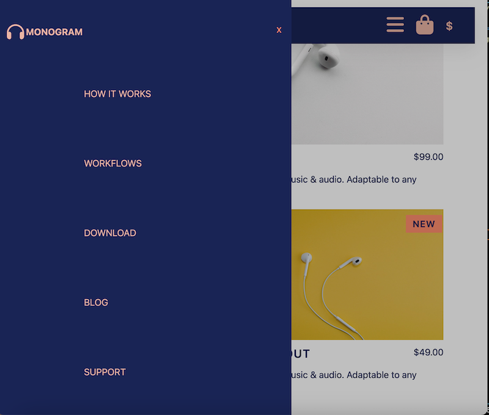

# Monogram Clone

A clone of Monogram's landing page with price converter and side menu

## Table of Contents
  * [Overview](https://github.com/WillShaner/Monogram-Clone/edit/main/README.md#Overview)
  * [Development](https://github.com/WillShaner/Monogram-Clone/edit/main/README.md#Development)
  * [Author](https://github.com/WillShaner/Monogram-Clone/edit/main/README.md#Author)
  
  
  
  
## Overview
  
### Screenshots





### Links
  * [Live Site](https://willshaner.github.io/Monogram-Clone/)

## Development
### Tech Stack
  For this project I used...
    - HTML5
    - CSS3
    - Javascript
### What I learned
  This project was a chance to practice side modals for smaller screen compared to dropdown menus. I needed a way to keep the user from scrolling once the modal was opened and I did this by added a height of 100vh and overflow hidden to the body once the modal was opened.
  ```javascript
  const menuOpen = () => {
  menu.classList.add('modal-open')
  document.body.classList.add('menu-open')
  } 

  const menuClose = () => {
    menu.classList.remove('modal-open')
    document.body.classList.remove('menu-open')
  }
  ```

  I also needed a way to store a base value for the price of each product that could be converted. I achieved this by storing a value for each price in the element and then converting that price to the current currency selected by the user.
  ```html
  <p class="product-price" aria-valuenow=49 >$49</p>
  ```

## Author

- [Linkedin](https://www.linkedin.com/in/will-shaner-315500245/)
- [Github](https://github.com/WillShaner?tab=repositories/)
- [Portfolio](https://genuine-sunflower-520c38.netlify.app/)


